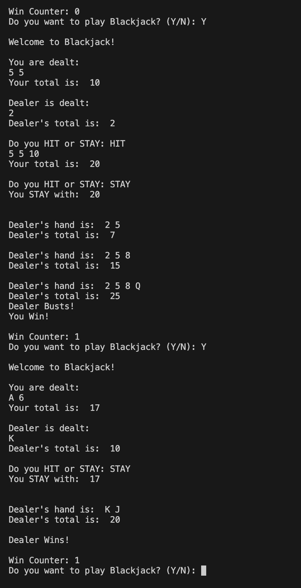

# 21-Game 
A simple terminal-based game where players compete against an AI dealer to reach 21 without going over.

## Features
- Simple terminal-based graphics using text
- AI dealer
- Displays win counter
- Allows players to hit or stand

## Setup
1. Install Python 3
2. Clone this repository
3. change current directory to 21-Game, then to src
- cd 21-Game
- cd src
5. run the game with
   python3 "21 Game.py"

## Instructions
1. After setting up the game, run it by using:
2. When the game starts, you are prompted whether you want to play the game or not. Type 'Y' to play, 'N' to quit.
3. Your goal is to get as close to 21 as possible without BUSTING, or to beat the dealer. The dealer has to stay past 16.
4. After each round, the game will display whether you win or the dealer wins, and the current win counter.
   
## Screenshot of gameplay

