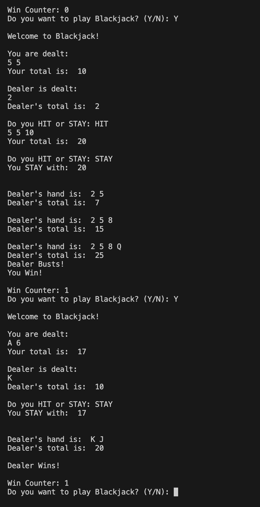

# 21-Game 
A simple terminal-based game where players compete against an AI dealer to reach 21 without going over.

## Features
- Simple graphics using terminal
- Displays win counter

## Setup
1. Install Python 3
2. Clone this repository

## Screenshots
